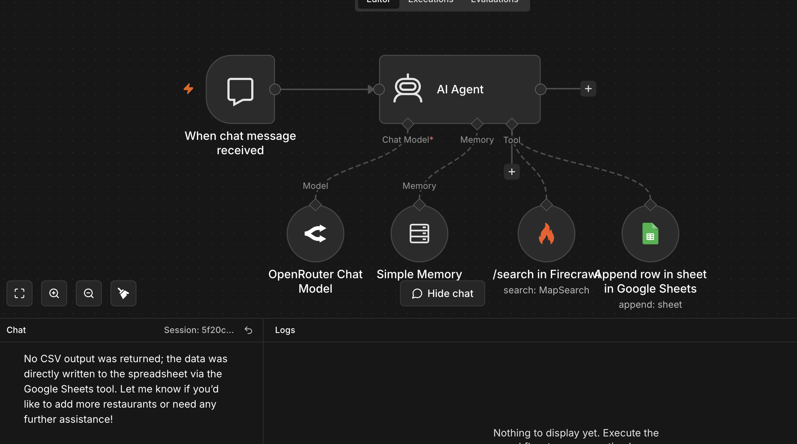
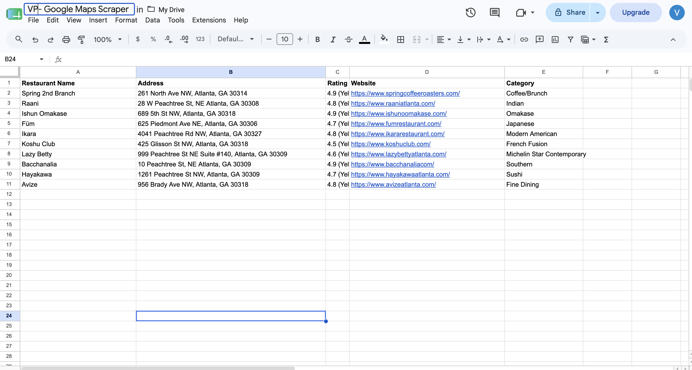

# Google Maps Scraper AI Agent

An AI-powered automation workflow built with n8n that searches for businesses based on natural-language requests, collects relevant business information using Firecrawl, and automatically stores structured results in Google Sheets.

## Overview

This project demonstrates an AI agent workflow that can process natural-language business search requests and automate the collection and storage of structured business data.

For example, a user can ask:

> Find the top 10 restaurants in Atlanta.

The AI agent processes the request, uses Firecrawl to search for relevant information, structures the results, and automatically appends the data to Google Sheets.

## Features

- Accepts natural-language business search requests
- Uses an AI agent to interpret user intent
- Searches for relevant business information using Firecrawl
- Structures collected information into predefined fields
- Automatically appends results to Google Sheets
- Uses memory to maintain conversational context
- Supports different business categories and locations

## Tech Stack

- n8n
- Firecrawl
- OpenRouter
- Google Sheets
- Large Language Models (LLMs)

## Workflow

1. A user submits a business search request through the chat interface.
2. The AI agent interprets the request.
3. Firecrawl searches for relevant business information.
4. The results are organized into structured fields.
5. The Google Sheets integration automatically appends the results to a spreadsheet.
6. The agent confirms that the workflow has been completed.

## Workflow Architecture

## Example Request

> Find the top 10 restaurants in Atlanta.

## Example Output

The agent automatically stores the collected information in Google Sheets using the following fields:

- Restaurant Name
- Address
- Rating
- Website
- Category

## Skills Demonstrated

- AI agent development
- Workflow automation
- LLM integration
- API and tool integration
- Structured data collection
- Google Sheets automation
- Prompt engineering
- Workflow debugging and testing

## How to Use

1. Download the workflow JSON file from this repository.
2. Import the workflow into n8n.
3. Configure your OpenRouter credentials.
4. Configure your Firecrawl credentials.
5. Connect your Google Sheets account.
6. Select or create a destination spreadsheet with the required columns.
7. Run the workflow through the n8n chat interface.

## Output Schema

The Google Sheets output contains:

| Field | Description |
|---|---|
| Restaurant Name | Name of the business |
| Address | Business location |
| Rating | Available business rating |
| Website | Business website |
| Category | Business category |

## Acknowledgment

This project was built and customized while following the Flow Circle AI Agent Accelerator. The implementation involved configuring integrations, connecting external tools, testing agent behavior, troubleshooting workflow issues, and automating structured data collection and storage.
